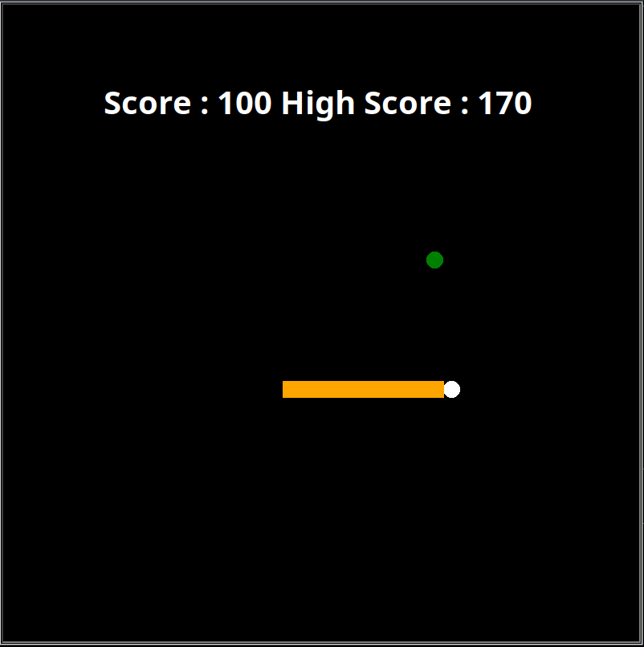

# Classic Snake Game in Python using Turtle Graphics 

This Python code implements a classic Snake game using the turtle library.  Players control a snake that grows longer by eating food and avoid colliding with walls or its own body.  The game keeps track of the score and high score. 

## Key Features: 

- Visually Appealing: The game uses colored turtles to represent the snake and food, creating a clear visual experience. 
- Keyboard Controls: Players use the WASD keys to change the snake's direction (up, down, left, right). 
- Boundary Detection: The game resets if the snake hits the screen boundaries, preventing unexpected behavior.
- Random Food Placement: Food appears at random locations within the boundaries, keeping the game dynamic. 
- Growing Snake: Each time the snake eats food, a new segment is added to its tail, increasing its length and the score. 
- Speed Adjustment: The game speed slightly increases as the snake grows, adding a challenge element. 
- High Score Tracking: The game remembers the highest score achieved across gameplay sessions. 
- Clean Code Structure: The code is well-organized with clear function definitions and comments, enhancing readability and maintainability. 

### How to Play: 

Run the Python script. 
- Use the WASD keys to control the snake's direction. 
- Eat the food to grow the snake and increase your score. 
- Avoid hitting the walls or the snake's body, as this will reset the game. 

### Libraries Used: 

- turtle: Provides functions for creating and manipulating turtle graphics within a graphical window. 
- time: Offers functionalities for controlling time delays within the game loop. 
- random: Generates random numbers used for food placement and color/shape selection. 
- This code provides a fun and engaging implementation of the classic Snake game using Python's Turtle graphics library.  Feel free to customize the game's appearance, difficulty, or functionalities for further exploration.
